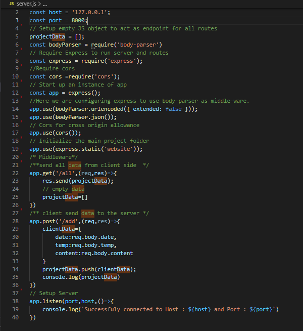
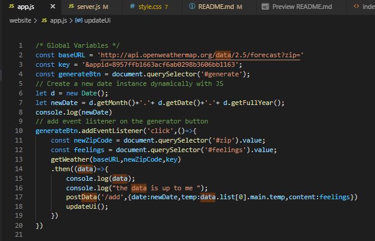
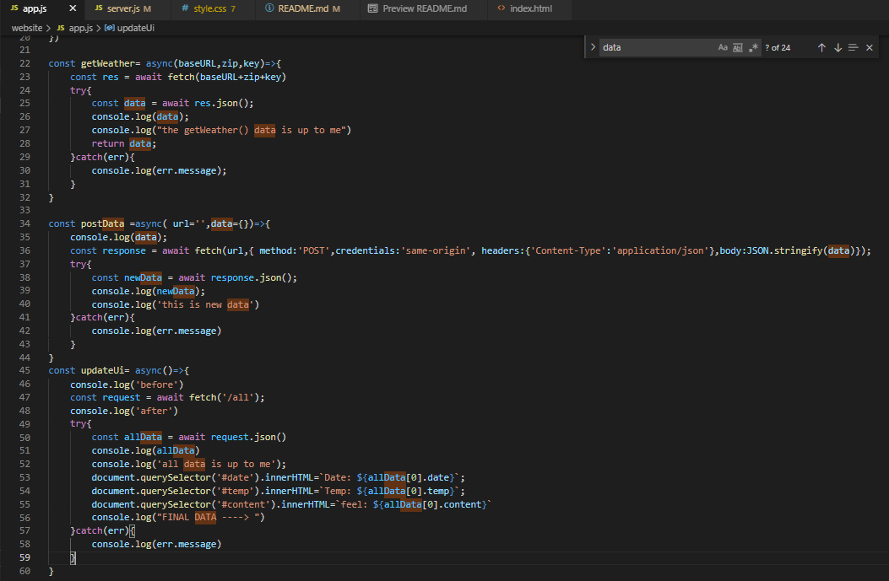
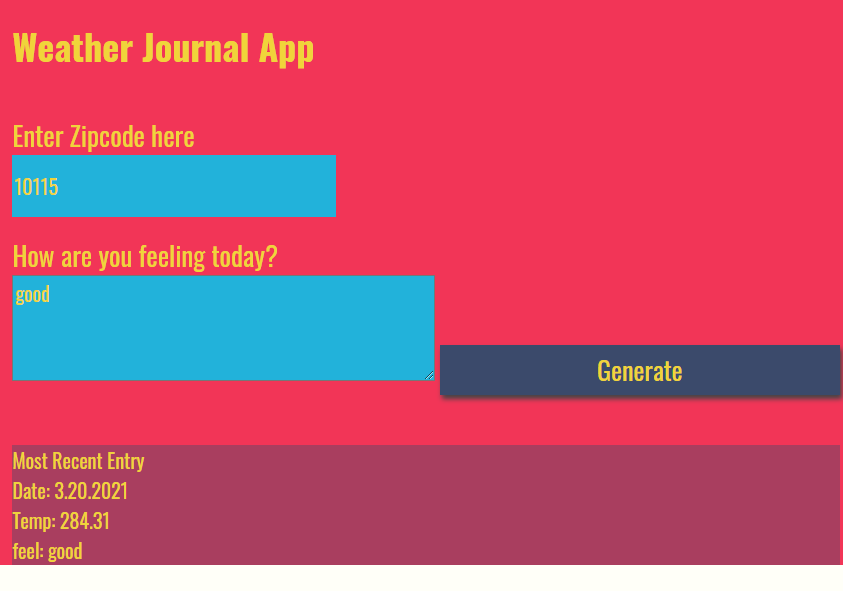

# Weather-Journal App Project

## Weather Journal App (Front End Developer Udacity Nanodegree):
#### technologies used:  HTML, CSS, (vanilla)js node js 
## Project Objectives: 
#### about working with Web APIs and asynchronous code, creating a web app that uses OpenWeatherMap API to get weather based on user's location.
## prerequisits: 
     1. Setup Node and packages (express, cors and body-parser) must be installed.
     2. Create the server that listens on a Port and a host (local host).
## Development Stratiegy: 
     - Create the server with localhost (172.0.0.1) and port (8000).
     - Installing Express, CORS and body-parser.
     - create get and post API to control reqused and responsed data.
     - generate a public key from openWeather API and use it as a url header for the application. 
     - using vanilla js to control HTML elements and add action listener to the generate button.
     - handling date and data from the weather API and add it to the HTML elements.
## Code area 
## for the server: 

## For the api global var and action listener button:

## For the rest:

## Final Result: 
